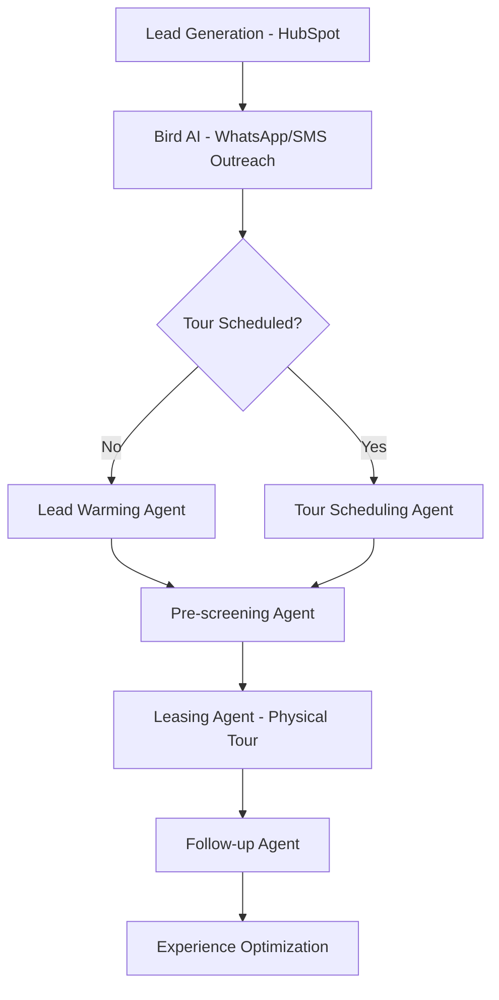

# UrbanHub AI Agents for Bird.com

> Comprehensive AI agent ecosystem built on Bird.com platform to automate UrbanHub's customer acquisition workflow across Mexico.

## 🏢 Project Overview

UrbanHub AI Agents is an intelligent conversational system that automates the complete customer acquisition journey for real estate operations. Built on the Bird.com omnichannel messaging platform, this system handles lead qualification, warming, tour scheduling, and follow-up automation through specialized AI agents designed specifically for the Mexican real estate market.

### Target Markets
- **Mexico City**: 1,300+ apartments across 9 properties (65,000 m² residential, 4,200 m² commercial)
- **Mérida**: Premium coworking space with Herman Miller furniture
- **Expansion Goal**: Scale to 15,000+ properties over 10 years with $300M investment

## 🤖 AI Agent Architecture

### Specialized Conversational Agents

1. **Lead Qualifier Agent** - Initial contact classification and basic qualification
2. **Lead Warming Agent** - Automated WhatsApp/SMS outreach for unresponsive leads
3. **Tour Scheduling Agent** - Calendar management and tour booking automation
4. **Pre-screening Agent** - Intelligent information collection by importance priority
5. **Follow-up Agent** - Post-tour experience feedback and conversion optimization
6. **Escalation Agent** - Intelligent routing to human agents when needed

### Customer Acquisition Flow



## 🛠 Technology Stack

| Component | Technology |
|-----------|------------|
| **Platform** | Bird.com omnichannel messaging |
| **Backend** | Node.js with TypeScript |
| **Database** | PostgreSQL |
| **AI Engine** | OpenAI GPT models |
| **Messaging** | WhatsApp Business API, SMS, Email |
| **Integrations** | HubSpot CRM, Calendars, OXXO payments |
| **Framework** | BMAD-METHOD for agent development |

## 🚀 Quick Start

### Prerequisites

- Node.js 18+ and npm
- PostgreSQL database
- Bird.com account with API access
- HubSpot CRM integration
- OpenAI API key

### Installation

```bash
# Clone the repository
git clone <repository-url>
cd urbanhub

# Install dependencies
npm install

# Setup Bird.com integration
npm run bird:setup

# Initialize BMAD framework
npm run bmad:init

# Start development server
npm run dev
```

### Configuration

1. **Bird.com Setup**: Configure API credentials and webhook endpoints
2. **Database**: Setup PostgreSQL for conversation tracking and lead management
3. **Integrations**: Connect HubSpot CRM and calendar systems
4. **AI Models**: Configure OpenAI GPT models for conversation processing

## 📋 Development Commands

### Bird.com Integration
```bash
npm run bird:setup              # Setup API configuration and webhooks
npm run bird:test-webhook       # Test webhook connectivity
npm run bird:deploy-agents      # Deploy AI agents to platform
npm run bird:sync-templates     # Sync WhatsApp message templates
```

### Agent Development
```bash
npm run agent:test              # Test individual agent responses
npm run agent:validate          # Validate agent configurations
npm run agent:simulate          # Simulate conversation flows
```

### BMAD Framework
```bash
npm run bmad:init               # Initialize BMAD session
npm run bmad:story              # Create user stories for agents
npm run bmad:architect          # Run architecture planning
```

### Quality & Testing
```bash
npm test                        # Run test suite
npm run typecheck               # TypeScript compilation check
npx prettier --write .          # Format code
```

## 🏗 Project Structure

```
├── bmad-config.yaml              # BMAD configuration
├── bmad-core/                    # Core BMAD framework
│   └── expansion-packs/
│       └── urbanhub-real-estate/ # Real estate domain agents
├── docs/                         # Documentation
│   ├── brief.md                  # Project requirements
│   ├── bird-*.md                 # Bird.com API docs
│   └── workflow-diagram.mmd      # Customer flow diagram
├── src/                          # Source code (future)
│   ├── agents/                   # AI agent implementations
│   ├── services/                 # Bird.com API integration
│   ├── webhooks/                 # Real-time event handlers
│   ├── models/                   # Database models
│   └── utils/                    # Shared utilities
└── config/                       # Integration configurations
```

## 🌟 Key Features

### Conversation Intelligence
- **Natural Language Processing**: Advanced Spanish conversation capabilities with Mexican expressions
- **Context Awareness**: Maintain conversation history and user preferences throughout the journey
- **Escalation Logic**: Smart routing to human agents when needed
- **Cultural Sensitivity**: Appropriate for Mexican business practices and communication styles

### Business Automation
- **Lead Response Time**: < 5 minutes for initial AI contact
- **Tour Conversion**: 25%+ of qualified leads schedule tours
- **Automation Coverage**: 80%+ of interactions handled by AI
- **Operational Efficiency**: 60% reduction in manual lead management

### Integration Ecosystem
- **HubSpot CRM**: Automated lead data sync and management
- **WhatsApp Business**: Primary communication channel for Mexican market
- **Calendar Systems**: Seamless tour scheduling with Leasing Agents
- **Payment Methods**: SPEI, OXXO, credit/debit card integration

## 📊 Success Metrics

### Automation Efficiency
- **Lead Response Time**: < 5 minutes for initial AI contact
- **Tour Conversion Rate**: 25%+ of qualified leads schedule tours
- **Automation Coverage**: 80%+ of interactions handled by AI agents
- **Escalation Rate**: < 15% of conversations require human intervention

### Conversation Quality
- **User Satisfaction**: 4.5+ stars average for AI interaction experience
- **Conversation Completion**: 90%+ of initiated conversations reach logical conclusion
- **Understanding Rate**: 95%+ of user intents correctly identified
- **Response Accuracy**: 98%+ of agent responses factually correct

### Business Impact
- **Lead Velocity**: 50% reduction in time from lead to tour scheduled
- **Operational Efficiency**: 60% reduction in manual lead management tasks
- **Leasing Agent Productivity**: 40% increase in tours per agent per day
- **Cost per Lead**: 30% reduction in customer acquisition costs

## 🔒 Security & Compliance

### Data Protection
- **GDPR Compliance**: Mexican data protection law compliance
- **Webhook Validation**: Always validate Bird.com webhook signatures
- **Encryption**: Proper encryption for sensitive data storage
- **Rate Limiting**: Implement proper API call rate limiting

### Agent Safety
- Never expose internal system information to users
- Never make promises about property availability without verification
- Never collect sensitive personal information beyond business needs
- Never bypass escalation when human intervention is required

## 🛡 Development Guidelines

### Integration Best Practices

**MUST Rules** (enforced):
- **A-1**: Always validate webhook signatures from Bird.com
- **A-2**: Implement proper rate limiting for all API calls
- **A-3**: Log all conversation interactions for analysis
- **A-4**: Use approved WhatsApp templates for business messages
- **A-5**: Maintain GDPR compliance for Mexican data protection

### Conversation Design Principles
1. **User-Centric**: Always prioritize user experience and natural conversation flow
2. **Goal-Oriented**: Every conversation should progress toward business objectives
3. **Context-Aware**: Maintain conversation history and user preferences
4. **Escalation-Ready**: Know when to involve human agents appropriately

## 📚 Documentation

| Document | Description |
|----------|-------------|
| [CLAUDE.md](./CLAUDE.md) | Complete development guidelines and agent architecture |
| [docs/brief.md](./docs/brief.md) | Updated project requirements for AI agent system |
| [docs/bird-integration-guide.md](./docs/bird-integration-guide.md) | Complete Bird.com API integration documentation |
| [docs/conversation-flows.md](./docs/conversation-flows.md) | User journey and dialog design specifications |
| [workflow-diagram.mmd](./workflow-diagram.mmd) | Customer acquisition flow diagram |

## 🤝 Contributing

### Development Workflow
1. **Planning Phase**: Create ACTION_PLAN.md for complex tasks
2. **Approval Phase**: Get human approval before implementation
3. **Implementation Phase**: Work on todo items sequentially
4. **Quality Assurance**: Run tests and linting after each change
5. **Documentation**: Update progress and summarize changes

### Commit Standards
```bash
# Conventional commits format
feat(agent): add lead qualification logic for Mexico City properties
fix(webhook): resolve Bird.com signature validation failure
docs(setup): update WhatsApp Business API configuration guide
```

## 📞 Support

For questions, issues, or contributions:
- **Documentation**: Check the `docs/` directory for detailed guides
- **Issues**: Use GitHub issues for bug reports and feature requests
- **BMAD Framework**: Consult `bmad-core/` for agent development methodology

## 📄 License

This project is proprietary software for UrbanHub Mexico operations.

---

**Built with 🤖 by the UrbanHub AI Team**

*Revolutionizing real estate customer acquisition through intelligent conversation automation*