# UrbanHub AI Agents for Bird.com

> 🤖 MAYA AI - Automatización inteligente de leads inmobiliarios con Bird.com para el mercado mexicano

## 🏢 Project Overview

UrbanHub AI Agents implementa MAYA, un AI Employee especializado en bienes raíces que automatiza todo el journey de adquisición de clientes. Construido nativamente en la plataforma Bird.com, MAYA transforma la gestión de leads con respuestas instantáneas en WhatsApp, calificación inteligente y agendamiento automático de tours - todo diseñado específicamente para el mercado inmobiliario premium de México.

### 🎯 Problema que Resolvemos
- **Antes**: Respuesta manual >24 horas, 10% conversión, agentes sobrecargados
- **Con MAYA**: Respuesta <2 minutos, 25% conversión, 80% automatización

### Target Markets
- **Mexico City**: 1,300+ apartments across 9 properties (65,000 m² residential, 4,200 m² commercial)
- **Mérida**: Premium coworking space with Herman Miller furniture
- **Expansion Goal**: Scale to 15,000+ properties over 10 years with $300M investment

## 🤖 MAYA AI - Tu Employee Virtual en Bird.com

### ✨ Capacidades de MAYA

1. **⚡ Respuesta Instantánea** - <2 minutos 24/7 en WhatsApp
2. **🎯 Calificación Inteligente** - Entiende necesidades y presupuesto automáticamente
3. **📅 Agendamiento Sin Fricción** - Tours confirmados sin intervención humana
4. **🔥 Reactivación de Leads** - Warming inteligente para leads no responsivos
5. **💬 Conversación Natural** - Español mexicano con contexto cultural
6. **🚨 Escalación Smart** - Handoff perfecto cuando se necesita un humano

### 🚀 Customer Journey Automatizado

```mermaid
graph LR
    A[Lead entra] --> B[MAYA responde <2min]
    B --> C[Califica necesidades]
    C --> D{¿Listo para tour?}
    D -->|Sí| E[Agenda tour]
    D -->|No| F[Inicia warming]
    F --> G[Reengagement]
    E --> H[Tour confirmado]
    G --> H
    H --> I[Cliente feliz 😊]
```



## 🛠 Technology Stack

| Component | Technology |
|-----------|------------|
| **Platform** | Bird.com - All-in-one conversational AI |
| **AI Employee** | MAYA configurada nativamente en Bird.com |
| **Messaging** | WhatsApp Business (principal), SMS, Email |
| **CRM Integration** | HubSpot via Bird.com webhooks |
| **Analytics** | Bird.com native dashboard & insights |
| **Automation** | Bird.com workflow builder (no-code) |

## 🚀 Quick Start

### Prerequisites

- Node.js 18+ and npm
- PostgreSQL database
- Bird.com account with API access
- HubSpot CRM integration
- OpenAI API key

### Installation

```bash
# Clone the repository
git clone <repository-url>
cd urbanhub

# Install dependencies
npm install

# Setup Bird.com integration
npm run bird:setup

# Initialize BMAD framework
npm run bmad:init

# Start development server
npm run dev
```

### Configuration

1. **Bird.com Setup**: Configure API credentials and webhook endpoints
2. **Database**: Setup PostgreSQL for conversation tracking and lead management
3. **Integrations**: Connect HubSpot CRM and calendar systems
4. **AI Models**: Configure OpenAI GPT models for conversation processing

## 📋 Development Commands

### Bird.com Integration
```bash
npm run bird:setup              # Setup API configuration and webhooks
npm run bird:test-webhook       # Test webhook connectivity
npm run bird:deploy-agents      # Deploy AI agents to platform
npm run bird:sync-templates     # Sync WhatsApp message templates
```

### Agent Development
```bash
npm run agent:test              # Test individual agent responses
npm run agent:validate          # Validate agent configurations
npm run agent:simulate          # Simulate conversation flows
```

### BMAD Framework
```bash
npm run bmad:init               # Initialize BMAD session
npm run bmad:story              # Create user stories for agents
npm run bmad:architect          # Run architecture planning
```

### Quality & Testing
```bash
npm test                        # Run test suite
npm run typecheck               # TypeScript compilation check
npx prettier --write .          # Format code
```

## 🏗 Project Structure

```
├── bmad-config.yaml              # BMAD configuration
├── bmad-core/                    # Core BMAD framework
│   └── expansion-packs/
│       └── urbanhub-real-estate/ # Real estate domain agents
├── docs/                         # Documentation
│   ├── brief.md                  # Project requirements
│   ├── bird-*.md                 # Bird.com API docs
│   └── workflow-diagram.mmd      # Customer flow diagram
├── src/                          # Source code (future)
│   ├── agents/                   # AI agent implementations
│   ├── services/                 # Bird.com API integration
│   ├── webhooks/                 # Real-time event handlers
│   ├── models/                   # Database models
│   └── utils/                    # Shared utilities
└── config/                       # Integration configurations
```

## 🌟 Key Features

### Conversation Intelligence
- **Natural Language Processing**: Advanced Spanish conversation capabilities with Mexican expressions
- **Context Awareness**: Maintain conversation history and user preferences throughout the journey
- **Escalation Logic**: Smart routing to human agents when needed
- **Cultural Sensitivity**: Appropriate for Mexican business practices and communication styles

### Business Automation
- **Lead Response Time**: < 5 minutes for initial AI contact
- **Tour Conversion**: 25%+ of qualified leads schedule tours
- **Automation Coverage**: 80%+ of interactions handled by AI
- **Operational Efficiency**: 60% reduction in manual lead management

### Integration Ecosystem
- **HubSpot CRM**: Automated lead data sync and management
- **WhatsApp Business**: Primary communication channel for Mexican market
- **Calendar Systems**: Seamless tour scheduling with Leasing Agents
- **Payment Methods**: SPEI, OXXO, credit/debit card integration

## 📊 Resultados Esperados con MAYA

### 🎯 Métricas de Éxito

| Métrica | Antes | Con MAYA | Mejora |
|---------|-------|----------|--------|
| **Tiempo de Respuesta** | >24 horas | <2 minutos | 99% ⬆️ |
| **Conversión Lead-Tour** | 10% | 25% | 150% ⬆️ |
| **Automatización** | 0% | 80% | ∞ |
| **Satisfacción Cliente** | 3.5/5 | 4.5/5 | ⭐ |
| **Tours por Agente/Día** | 3-4 | 5-7 | 75% ⬆️ |

### 💰 ROI Proyectado

- **Mes 1-2**: Implementación y ajustes
- **Mes 3**: Break-even operacional
- **Mes 4+**: ROI positivo con reducción 30% en costo por lead
- **Año 1**: Capacidad para escalar a 15,000+ propiedades sin personal adicional

## 🔒 Security & Compliance

### Data Protection
- **GDPR Compliance**: Mexican data protection law compliance
- **Webhook Validation**: Always validate Bird.com webhook signatures
- **Encryption**: Proper encryption for sensitive data storage
- **Rate Limiting**: Implement proper API call rate limiting

### Agent Safety
- Never expose internal system information to users
- Never make promises about property availability without verification
- Never collect sensitive personal information beyond business needs
- Never bypass escalation when human intervention is required

## 🛡 Development Guidelines

### Integration Best Practices

**MUST Rules** (enforced):
- **A-1**: Always validate webhook signatures from Bird.com
- **A-2**: Implement proper rate limiting for all API calls
- **A-3**: Log all conversation interactions for analysis
- **A-4**: Use approved WhatsApp templates for business messages
- **A-5**: Maintain GDPR compliance for Mexican data protection

### Conversation Design Principles
1. **User-Centric**: Always prioritize user experience and natural conversation flow
2. **Goal-Oriented**: Every conversation should progress toward business objectives
3. **Context-Aware**: Maintain conversation history and user preferences
4. **Escalation-Ready**: Know when to involve human agents appropriately

## 📚 Documentation

| Document | Description |
|----------|-------------|
| [CLAUDE.md](./CLAUDE.md) | Complete development guidelines and agent architecture |
| [maya-ai-implementation-diagram.mmd](./maya-ai-implementation-diagram.mmd) | **📊 Diagrama ejecutivo de MAYA AI para presentación CEO** |
| [docs/brief.md](./docs/brief.md) | Updated project requirements for AI agent system |
| [docs/bird-integration-guide.md](./docs/bird-integration-guide.md) | Complete Bird.com API integration documentation |
| [docs/conversation-flows.md](./docs/conversation-flows.md) | User journey and dialog design specifications |
| [workflow-diagram.mmd](./workflow-diagram.mmd) | Customer acquisition flow diagram |

### 🎨 Diagrama de Arquitectura MAYA

Ver [maya-ai-implementation-diagram.mmd](./maya-ai-implementation-diagram.mmd) para el diagrama ejecutivo completo que muestra:
- El problema actual de UrbanHub
- La solución con MAYA en Bird.com
- El journey automatizado del cliente
- Casos de éxito reales
- Métricas de impacto y ROI
- Integración con HubSpot
- Escalabilidad para crecimiento futuro

## 🤝 Contributing

### Development Workflow
1. **Planning Phase**: Create ACTION_PLAN.md for complex tasks
2. **Approval Phase**: Get human approval before implementation
3. **Implementation Phase**: Work on todo items sequentially
4. **Quality Assurance**: Run tests and linting after each change
5. **Documentation**: Update progress and summarize changes

### Commit Standards
```bash
# Conventional commits format
feat(agent): add lead qualification logic for Mexico City properties
fix(webhook): resolve Bird.com signature validation failure
docs(setup): update WhatsApp Business API configuration guide
```

## 📞 Support

For questions, issues, or contributions:
- **Documentation**: Check the `docs/` directory for detailed guides
- **Issues**: Use GitHub issues for bug reports and feature requests
- **BMAD Framework**: Consult `bmad-core/` for agent development methodology

## 📄 License

This project is proprietary software for UrbanHub Mexico operations.

---

**Built with 🤖 by the UrbanHub AI Team**

*Revolutionizing real estate customer acquisition through intelligent conversation automation*