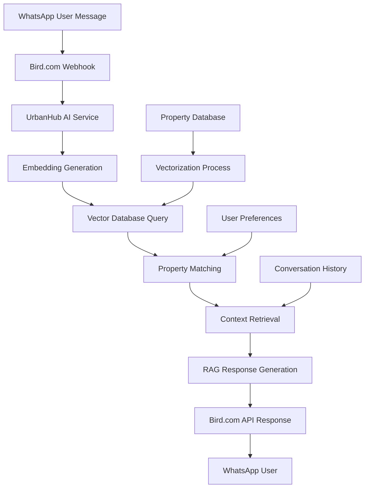

# Implementación de Embedding Search con Bird.com - UrbanHub

## Documento Técnico

**Fecha**: 24 de julio, 2025  
**Proyecto**: UrbanHub AI Agents - Embedding Search System  
**Plataforma**: Bird.com + OpenAI + Vector Database  
**Enfoque**: Búsqueda semántica inteligente para propiedades inmobiliarias

---

## Resumen Ejecutivo

Bird.com no proporciona capacidades nativas de embedding search o AI avanzado. Este documento detalla la implementación de un sistema de búsqueda semántica personalizado que se integra con la infraestructura de mensajería de Bird.com para proporcionar recomendaciones inteligentes de propiedades basadas en preferencias del usuario.

### Objetivos del Sistema

1. **Búsqueda Semántica**: Matching inteligente entre consultas de usuarios y propiedades
2. **Recomendaciones Personalizadas**: Sugerencias basadas en preferencias implícitas y explícitas  
3. **Respuestas Contextuales**: RAG (Retrieval-Augmented Generation) para información precisa
4. **Integración Seamless**: Funcionamiento transparente con Bird.com y Maya

---

## 1. Arquitectura del Sistema

### 1.1 Componentes Principales

```typescript
// Arquitectura de Embedding Search para UrbanHub
interface EmbeddingSearchArchitecture {
  components: {
    vectorDatabase: VectorDB;           // Pinecone/Weaviate
    embeddingService: OpenAIEmbeddings; // text-embedding-ada-002
    knowledgeBase: PropertyKB;          // UrbanHub property data
    ragEngine: RAGProcessor;            // Retrieval-Augmented Generation
    birdIntegration: BirdWebhook;       // Messaging platform interface
  };
  
  dataFlow: {
    input: 'User WhatsApp message via Bird.com webhook';
    processing: 'Embedding generation → Vector search → Context retrieval';
    output: 'Personalized response via Bird.com API';
  };
}
```

### 1.2 Flujo de Datos



---

## 2. Vector Database Implementation

### 2.1 Pinecone Configuration

```typescript
// Pinecone Setup para UrbanHub
import { Pinecone } from '@pinecone-database/pinecone';

class UrbanHubVectorDB {
  private pinecone: Pinecone;
  private indexName = 'urbanhub-properties';
  
  constructor() {
    this.pinecone = new Pinecone({
      apiKey: process.env.PINECONE_API_KEY!,
      environment: 'us-west1-gcp-free' // Free tier
    });
  }
  
  async initializeIndex(): Promise<void> {
    // Crear índice si no existe
    const existingIndexes = await this.pinecone.listIndexes();
    
    if (!existingIndexes.includes(this.indexName)) {
      await this.pinecone.createIndex({
        name: this.indexName,
        dimension: 1536, // OpenAI text-embedding-ada-002
        metric: 'cosine',
        pods: 1,
        podType: 'p1.x1',
        replicas: 1
      });
    }
  }
  
  async upsertProperty(property: PropertyData): Promise<void> {
    const index = this.pinecone.index(this.indexName);
    
    // Generar texto descriptivo completo de la propiedad
    const propertyText = this.generatePropertyDescription(property);
    
    // Crear embedding
    const embedding = await this.generateEmbedding(propertyText);
    
    // Upsert en Pinecone
    await index.upsert([{
      id: property.id,
      values: embedding,
      metadata: {
        name: property.name,
        type: property.type,
        price: property.price,
        location: property.location,
        amenities: property.amenities,
        availability: property.availability,
        lastUpdated: new Date().toISOString()
      }
    }]);
  }
  
  private generatePropertyDescription(property: PropertyData): string {
    return `
      Propiedad: ${property.name}
      Ubicación: ${property.location.address}, ${property.location.neighborhood}
      Tipo: ${property.type} - ${property.bedrooms} recámaras, ${property.bathrooms} baños
      Precio: $${property.price} MXN mensuales
      Amenidades: ${property.amenities.join(', ')}
      Características: ${property.features.join(', ')}
      Descripción: ${property.description}
      Transporte: ${property.transportation.join(', ')}
      Estilo: ${property.style}
      Tamaño: ${property.squareMeters} m²
    `.trim();
  }
}
```

### 2.2 Property Data Vectorization

```typescript
// Sistema de Vectorización de Propiedades  
interface PropertyVectorData {
  id: string;
  embedding: number[];
  metadata: {
    // Datos básicos
    name: string;
    type: 'studio' | '1br' | '2br' | '3br';
    price: number;
    size: number;
    
    // Ubicación
    building: 'josefa' | 'matilde';
    neighborhood: string;
    address: string;
    coordinates: [number, number];
    
    // Características
    amenities: string[];
    features: string[];
    style: string;
    furnished: boolean;
    
    // Disponibilidad
    available: boolean;
    availableDate: string;
    leaseTerm: string[];
    
    // Scoring
    popularityScore: number;
    viewScore: number;
    amenityScore: number;
  };
}

class PropertyVectorizer {
  private openai: OpenAI;
  
  async vectorizeAllProperties(): Promise<void> {
    // Datos de Josefa (Reforma 390)
    const josefaUnits = await this.getJosefaInventory();
    const josefaVectors = await Promise.all(
      josefaUnits.map(unit => this.vectorizeProperty(unit))
    );
    
    // Datos de Matilde (Donato Guerra 1)
    const matildeUnits = await this.getMatildeInventory();
    const matildeVectors = await Promise.all(
      matildeUnits.map(unit => this.vectorizeProperty(unit))
    );
    
    // Upsert all vectors
    const allVectors = [...josefaVectors, ...matildeVectors];
    await this.vectorDB.upsertBatch(allVectors);
  }
  
  private async vectorizeProperty(property: PropertyData): Promise<PropertyVectorData> {
    // Generar descripción rica para embedding
    const description = this.createRichDescription(property);
    
    // Generar embedding
    const embedding = await this.openai.embeddings.create({
      model: 'text-embedding-ada-002',
      input: description
    });
    
    return {
      id: property.id,
      embedding: embedding.data[0].embedding,
      metadata: this.extractMetadata(property)
    };
  }
  
  private createRichDescription(property: PropertyData): string {
    // Descripción optimizada para embedding quality
    const descriptions = [
      // Descripción básica
      `${property.type} en ${property.building} ubicado en ${property.neighborhood}`,
      
      // Características clave
      `Departamento ${property.furnished ? 'amueblado' : 'sin amueblar'} de ${property.size}m²`,
      
      // Amenidades como experiencias
      property.amenities.map(amenity => `Incluye ${amenity} para residentes`).join(', '),
      
      // Lifestyle y ubicación
      `Perfecto para profesionales que valoran ${property.lifestyle?.join(', ')}`,
      
      // Transporte y conveniencia  
      `Excelente conectividad: ${property.transportation?.join(', ')}`,
      
      // Precio y términos
      `Renta desde $${property.price} MXN con ${property.terms?.join(', ')}`
    ];
    
    return descriptions.filter(Boolean).join('. ');
  }
}
```

---

## 3. Semantic Search Implementation

### 3.1 Query Processing Engine

```typescript
// Motor de Procesamiento de Consultas
class SemanticQueryProcessor {
  private vectorDB: UrbanHubVectorDB;
  private openai: OpenAI;
  
  async processUserQuery(
    userMessage: string,
    conversationHistory: Message[],
    userProfile?: UserProfile
  ): Promise<SearchResults> {
    
    // 1. Extraer intención y parámetros de búsqueda
    const searchIntent = await this.extractSearchIntent(userMessage);
    
    // 2. Generar embedding de la consulta
    const queryEmbedding = await this.generateQueryEmbedding(
      userMessage, 
      conversationHistory
    );
    
    // 3. Construir filtros basados en contexto
    const filters = this.buildSearchFilters(searchIntent, userProfile);
    
    // 4. Ejecutar búsqueda en vector database
    const results = await this.vectorDB.semanticSearch({
      vector: queryEmbedding,
      topK: 5,
      filter: filters,
      includeMetadata: true
    });
    
    // 5. Reranking basado en preferencias
    const rankedResults = this.rerankResults(results, searchIntent, userProfile);
    
    return {
      properties: rankedResults,
      searchIntent,
      confidence: this.calculateConfidence(results),
      suggestions: this.generateSearchSuggestions(searchIntent)
    };
  }
  
  private async extractSearchIntent(message: string): Promise<SearchIntent> {
    const prompt = `
    Analiza el siguiente mensaje de un cliente interesado en rentar departamento en Ciudad de México.
    Extrae los parámetros de búsqueda:
    
    Mensaje: "${message}"
    
    Responde en JSON con:
    {
      "budget": number | null,
      "bedrooms": number | null, 
      "location_preference": string | null,
      "amenities": string[],
      "timeline": string | null,
      "lifestyle": string[],
      "intent_type": "search" | "compare" | "schedule" | "question"
    }
    `;
    
    const response = await this.openai.chat.completions.create({
      model: 'gpt-4',
      messages: [{ role: 'user', content: prompt }],
      temperature: 0.1
    });
    
    return JSON.parse(response.choices[0].message.content!);
  }
  
  private buildSearchFilters(
    intent: SearchIntent,
    profile?: UserProfile
  ): SearchFilters {
    const filters: SearchFilters = {
      available: true
    };
    
    // Budget filtering
    if (intent.budget || profile?.budget) {
      const budgetMax = intent.budget || profile?.budget?.max;
      filters.price = { $lte: budgetMax * 1.1 }; // 10% flexibility
    }
    
    // Bedroom filtering
    if (intent.bedrooms !== null) {
      filters.bedrooms = intent.bedrooms;
    }
    
    // Location preference
    if (intent.location_preference) {
      const locationKeywords = this.expandLocationKeywords(intent.location_preference);
      filters.$or = locationKeywords.map(keyword => ({
        $or: [
          { 'metadata.neighborhood': { $regex: keyword, $options: 'i' }},
          { 'metadata.address': { $regex: keyword, $options: 'i' }},
          { 'metadata.building': { $regex: keyword, $options: 'i' }}
        ]
      }));
    }
    
    return filters;
  }
}
```

### 3.2 Intelligent Property Matching

```typescript
// Sistema de Matching Inteligente
class IntelligentPropertyMatcher {
  async findBestMatches(
    userQuery: string,
    userPreferences: UserPreferences
  ): Promise<PropertyMatch[]> {
    
    // 1. Búsqueda semántica básica
    const semanticResults = await this.semanticSearch(userQuery);
    
    // 2. Scoring multifactorial
    const scoredResults = semanticResults.map(property => ({
      ...property,
      scores: {
        semantic: property.similarity,
        budget: this.calculateBudgetScore(property, userPreferences),
        location: this.calculateLocationScore(property, userPreferences),
        amenities: this.calculateAmenityScore(property, userPreferences),
        lifestyle: this.calculateLifestyleScore(property, userPreferences),
        availability: this.calculateAvailabilityScore(property, userPreferences)
      }
    }));
    
    // 3. Weighted scoring
    const weightedResults = scoredResults.map(result => ({
      ...result,
      finalScore: this.calculateWeightedScore(result.scores, userPreferences)
    }));
    
    // 4. Sort by final score
    return weightedResults
      .sort((a, b) => b.finalScore - a.finalScore)
      .slice(0, 3); // Top 3 matches
  }
  
  private calculateWeightedScore(
    scores: PropertyScores, 
    preferences: UserPreferences
  ): number {
    const weights = {
      semantic: 0.25,
      budget: preferences.budgetPriority || 0.30,
      location: preferences.locationPriority || 0.20,
      amenities: preferences.amenityPriority || 0.15,
      lifestyle: preferences.lifestylePriority || 0.10
    };
    
    return Object.entries(scores).reduce((total, [key, score]) => {
      return total + (score * (weights[key as keyof typeof weights] || 0));
    }, 0);
  }
  
  private calculateBudgetScore(
    property: PropertyData,
    preferences: UserPreferences
  ): number {
    if (!preferences.budget) return 0.5; // Neutral if no budget specified
    
    const { min, max, ideal } = preferences.budget;
    const price = property.price;
    
    if (price < min) return 0.3; // Too cheap might raise quality concerns
    if (price > max) return 0.1; // Over budget
    if (ideal && Math.abs(price - ideal) / ideal < 0.1) return 1.0; // Close to ideal
    
    // Linear scoring within range
    return 0.7 + (0.3 * (1 - Math.abs(price - ideal) / (max - min)));
  }
}
```

---

## 4. RAG (Retrieval-Augmented Generation)

### 4.1 Context Retrieval System

```typescript
// Sistema RAG para Respuestas Contextuales
class UrbanHubRAGEngine {
  private vectorDB: UrbanHubVectorDB;
  private knowledgeBase: PropertyKnowledgeBase;
  private openai: OpenAI;
  
  async generateContextualResponse(
    userQuery: string,
    searchResults: PropertyMatch[],
    conversationHistory: Message[]
  ): Promise<string> {
    
    // 1. Recuperar contexto relevante
    const context = await this.retrieveRelevantContext(userQuery, searchResults);
    
    // 2. Construir prompt con contexto
    const prompt = this.buildRAGPrompt(userQuery, context, conversationHistory);
    
    // 3. Generar respuesta contextual
    const response = await this.openai.chat.completions.create({
      model: 'gpt-4',
      messages: prompt,
      max_tokens: 400,
      temperature: 0.7
    });
    
    return response.choices[0].message.content!;
  }
  
  private async retrieveRelevantContext(
    query: string,
    properties: PropertyMatch[]
  ): Promise<RetrievedContext> {
    
    const context: RetrievedContext = {
      properties: properties.slice(0, 3), // Top 3 matches
      amenityDetails: {},
      neighborhoodInfo: {},
      processInfo: {},
      comparisons: []
    };
    
    // Recuperar detalles de amenidades mencionadas
    const mentionedAmenities = this.extractAmenities(query);
    for (const amenity of mentionedAmenities) {
      context.amenityDetails[amenity] = await this.getAmenityDetails(amenity);
    }
    
    // Información de vecindarios
    const neighborhoods = [...new Set(properties.map(p => p.metadata.neighborhood))];
    for (const neighborhood of neighborhoods) {
      context.neighborhoodInfo[neighborhood] = await this.getNeighborhoodInfo(neighborhood);
    }
    
    // Información de procesos si es relevante
    if (this.queryNeedsProcessInfo(query)) {
      context.processInfo = await this.getProcessInformation(query);
    }
    
    // Comparaciones si hay múltiples propiedades
    if (properties.length > 1) {
      context.comparisons = this.generateComparisons(properties);
    }
    
    return context;
  }
  
  private buildRAGPrompt(
    userQuery: string,
    context: RetrievedContext,
    history: Message[]
  ): ChatCompletionMessageParam[] {
    
    const systemPrompt = `
    Eres Maya, especialista en bienes raíces de UrbanHub. Tienes acceso a información detallada sobre nuestras propiedades.
    
    PROPIEDADES DISPONIBLES:
    ${context.properties.map(p => this.formatPropertyForPrompt(p)).join('\n\n')}
    
    INFORMACIÓN ADICIONAL:
    Amenidades: ${JSON.stringify(context.amenityDetails, null, 2)}
    Vecindarios: ${JSON.stringify(context.neighborhoodInfo, null, 2)}
    Procesos: ${JSON.stringify(context.processInfo, null, 2)}
    
    INSTRUCCIONES:
    1. Responde en español mexicano, tono profesional pero cálido
    2. Usa información específica de las propiedades mostradas
    3. Proporciona detalles concretos y útiles
    4. Si comparas propiedades, sé objetiva y destaca beneficios únicos
    5. Incluye call-to-action apropiado (tour, más información, etc.)
    6. Mantén respuestas entre 150-300 palabras
    `;
    
    const conversationContext = history.slice(-4).map(msg => ({
      role: msg.sender === 'user' ? 'user' as const : 'assistant' as const,
      content: msg.content
    }));
    
    return [
      { role: 'system', content: systemPrompt },
      ...conversationContext,
      { role: 'user', content: userQuery }
    ];
  }
  
  private formatPropertyForPrompt(property: PropertyMatch): string {
    return `
    **${property.metadata.name}** (Score: ${property.finalScore.toFixed(2)})
    - Ubicación: ${property.metadata.address}, ${property.metadata.neighborhood}
    - Tipo: ${property.metadata.type}, ${property.metadata.size}m²
    - Precio: $${property.metadata.price.toLocaleString()} MXN/mes
    - Amenidades: ${property.metadata.amenities.join(', ')}
    - Disponible: ${property.metadata.availableDate}
    - Características especiales: ${property.metadata.features.join(', ')}
    `;
  }
}
```

### 4.2 Knowledge Base Integration

```typescript
// Base de Conocimiento Integrada
class PropertyKnowledgeBase {
  private data: {
    properties: PropertyDetails[];
    amenities: AmenityGuide[];
    neighborhoods: NeighborhoodGuide[];
    processes: ProcessGuide[];
    faq: FAQItem[];
  };
  
  async getAmenityDetails(amenityName: string): Promise<AmenityDetails> {
    const amenity = this.data.amenities.find(a => 
      a.name.toLowerCase().includes(amenityName.toLowerCase()) ||
      a.aliases.some(alias => alias.toLowerCase().includes(amenityName.toLowerCase()))
    );
    
    if (!amenity) return { name: amenityName, description: 'Información no disponible' };
    
    return {
      name: amenity.name,
      description: amenity.description,
      locations: amenity.availableIn,
      hours: amenity.operatingHours,
      features: amenity.features,
      images: amenity.imageUrls,
      bookingRequired: amenity.requiresBooking
    };
  }
  
  async getNeighborhoodInfo(neighborhood: string): Promise<NeighborhoodInfo> {
    const info = this.data.neighborhoods.find(n => 
      n.name.toLowerCase() === neighborhood.toLowerCase()
    );
    
    return info || {
      name: neighborhood,
      description: 'Información del vecindario no disponible',
      transportation: [],
      attractions: [],
      dining: [],
      safety: 'N/A'
    };
  }
  
  async searchFAQ(query: string): Promise<FAQItem[]> {
    const queryEmbedding = await this.generateEmbedding(query);
    
    const faqWithScores = await Promise.all(
      this.data.faq.map(async (faq) => ({
        ...faq,
        similarity: this.calculateSimilarity(queryEmbedding, faq.embedding)
      }))
    );
    
    return faqWithScores
      .filter(faq => faq.similarity > 0.7)
      .sort((a, b) => b.similarity - a.similarity)
      .slice(0, 3);
  }
}
```

---

## 5. Bird.com Integration

### 5.1 Webhook Handler with Embedding Search

```typescript
// Webhook Handler Integrado con Embedding Search
class BirdWebhookHandler {
  private ragEngine: UrbanHubRAGEngine;
  private queryProcessor: SemanticQueryProcessor;
  private birdAPI: BirdAPIClient;
  
  async handleIncomingMessage(webhook: BirdWebhookPayload): Promise<void> {
    try {
      const { message, contact, conversation } = webhook;
      
      // 1. Procesar consulta con embedding search
      const searchResults = await this.queryProcessor.processUserQuery(
        message.content,
        conversation.history,
        contact.profile
      );
      
      // 2. Generar respuesta contextual con RAG
      const response = await this.ragEngine.generateContextualResponse(
        message.content,
        searchResults.properties,
        conversation.history
      );
      
      // 3. Enviar respuesta via Bird.com
      await this.birdAPI.sendMessage({
        channelId: webhook.channelId,
        contactId: contact.id,
        content: {
          type: 'text',
          text: response
        }
      });
      
      // 4. Actualizar perfil del usuario con preferencias inferidas
      await this.updateUserProfile(contact.id, searchResults.searchIntent);
      
      // 5. Log interaction para análisis
      await this.logInteraction({
        contactId: contact.id,
        query: message.content,
        searchResults: searchResults.properties.length,
        responseTime: Date.now() - webhook.timestamp
      });
      
    } catch (error) {
      console.error('Error processing message:', error);
      await this.handleError(webhook, error);
    }
  }
  
  private async updateUserProfile(
    contactId: string, 
    intent: SearchIntent
  ): Promise<void> {
    const updates = {
      lastInteraction: new Date(),
      preferences: {
        budget: intent.budget,
        bedrooms: intent.bedrooms,
        amenities: intent.amenities,
        lifestyle: intent.lifestyle
      },
      searchHistory: intent
    };
    
    await this.birdAPI.updateContact(contactId, updates);
  }
}
```

### 5.2 Response Enhancement with Rich Content

```typescript
// Enriquecimiento de Respuestas con Contenido Rico
class EnhancedResponseGenerator {
  async generateRichResponse(
    properties: PropertyMatch[],
    userQuery: string
  ): Promise<BirdMessage> {
    
    const topProperty = properties[0];
    
    // Base text response from RAG
    const textResponse = await this.ragEngine.generateContextualResponse(
      userQuery,
      properties,
      []
    );
    
    // Determine if rich content should be included
    const shouldIncludeImages = this.shouldIncludeImages(userQuery);
    const shouldIncludeCarousel = properties.length > 1;
    const shouldIncludeButtons = this.shouldIncludeButtons(userQuery);
    
    if (shouldIncludeCarousel) {
      return this.createPropertyCarousel(properties, textResponse);
    } else if (shouldIncludeImages) {
      return this.createImageResponse(topProperty, textResponse);
    } else if (shouldIncludeButtons) {
      return this.createButtonResponse(topProperty, textResponse);
    } else {
      return { type: 'text', content: textResponse };
    }
  }
  
  private createPropertyCarousel(
    properties: PropertyMatch[],
    introText: string
  ): BirdMessage {
    const cards = properties.slice(0, 3).map(property => ({
      title: property.metadata.name,
      subtitle: `$${property.metadata.price.toLocaleString()} MXN/mes • ${property.metadata.type}`,
      imageUrl: property.metadata.images?.[0],
      buttons: [
        {
          type: 'postback',
          title: 'Ver detalles',
          payload: `VIEW_PROPERTY_${property.id}`
        },
        {
          type: 'postback', 
          title: 'Agendar tour',
          payload: `SCHEDULE_TOUR_${property.id}`
        }
      ]
    }));
    
    return {
      type: 'carousel',
      content: {
        text: introText,
        cards: cards
      }
    };
  }
  
  private createImageResponse(
    property: PropertyMatch,
    text: string
  ): BirdMessage {
    return {
      type: 'media',
      content: {
        text: text,
        mediaUrl: property.metadata.images?.[0],
        mediaType: 'image',
        buttons: [
          {
            type: 'postback',
            title: 'Más fotos',
            payload: `VIEW_GALLERY_${property.id}`
          },
          {
            type: 'postback',
            title: 'Agendar visita',
            payload: `SCHEDULE_TOUR_${property.id}`
          }
        ]
      }
    };
  }
}
```

---

## 6. Performance Optimization

### 6.1 Caching Strategy

```typescript
// Estrategia de Caching para Optimización
class EmbeddingSearchCache {
  private redis: RedisClient;
  private CACHE_TTL = {
    embeddings: 24 * 60 * 60, // 24 horas
    searchResults: 30 * 60,   // 30 minutos
    userProfiles: 60 * 60     // 1 hora
  };
  
  async getCachedEmbedding(text: string): Promise<number[] | null> {
    const key = `embedding:${this.hash(text)}`;
    const cached = await this.redis.get(key);
    return cached ? JSON.parse(cached) : null;
  }
  
  async setCachedEmbedding(text: string, embedding: number[]): Promise<void> {
    const key = `embedding:${this.hash(text)}`;
    await this.redis.setex(key, this.CACHE_TTL.embeddings, JSON.stringify(embedding));
  }
  
  async getCachedSearchResults(
    query: string,
    filters: SearchFilters
  ): Promise<PropertyMatch[] | null> {
    const key = `search:${this.hash(query + JSON.stringify(filters))}`;
    const cached = await this.redis.get(key);
    return cached ? JSON.parse(cached) : null;
  }
  
  async setCachedSearchResults(
    query: string,
    filters: SearchFilters,
    results: PropertyMatch[]
  ): Promise<void> {
    const key = `search:${this.hash(query + JSON.stringify(filters))}`;
    await this.redis.setex(key, this.CACHE_TTL.searchResults, JSON.stringify(results));
  }
  
  private hash(input: string): string {
    return crypto.createHash('md5').update(input).digest('hex');
  }
}
```

### 6.2 Batch Processing and Optimization

```typescript
// Procesamiento por Lotes y Optimización
class BatchEmbeddingProcessor {
  private openai: OpenAI;
  private batchSize = 100;
  
  async processBatchEmbeddings(texts: string[]): Promise<number[][]> {
    const batches = this.chunkArray(texts, this.batchSize);
    const results: number[][] = [];
    
    for (const batch of batches) {
      try {
        const response = await this.openai.embeddings.create({
          model: 'text-embedding-ada-002',
          input: batch
        });
        
        results.push(...response.data.map(item => item.embedding));
        
        // Rate limiting - pausa entre batches
        await this.sleep(100);
        
      } catch (error) {
        console.error('Batch embedding error:', error);
        // Retry logic o fallback
        const fallbackResults = await this.processIndividually(batch);
        results.push(...fallbackResults);
      }
    }
    
    return results;
  }
  
  private chunkArray<T>(array: T[], size: number): T[][] {
    const chunks: T[][] = [];
    for (let i = 0; i < array.length; i += size) {
      chunks.push(array.slice(i, i + size));
    }
    return chunks;
  }
  
  private async sleep(ms: number): Promise<void> {
    return new Promise(resolve => setTimeout(resolve, ms));
  }
}
```

---

## 7. Deployment and Monitoring

### 7.1 Infrastructure Setup

```yaml
# docker-compose.yml para Embedding Search
version: '3.8'
services:
  urbanhub-ai:
    build: .
    environment:
      - OPENAI_API_KEY=${OPENAI_API_KEY}
      - PINECONE_API_KEY=${PINECONE_API_KEY}
      - BIRD_API_KEY=${BIRD_API_KEY}
      - REDIS_URL=${REDIS_URL}
    ports:
      - "3000:3000"
    depends_on:
      - redis
      - postgres
  
  redis:
    image: redis:7-alpine
    volumes:
      - redis_data:/data
  
  postgres:
    image: postgres:15
    environment:
      - POSTGRES_DB=urbanhub
      - POSTGRES_USER=postgres
      - POSTGRES_PASSWORD=${POSTGRES_PASSWORD}
    volumes:
      - postgres_data:/var/lib/postgresql/data

volumes:
  redis_data:
  postgres_data:
```

### 7.2 Monitoring and Analytics

```typescript
// Sistema de Monitoreo y Analytics
class EmbeddingSearchMonitoring {
  private metrics: MetricsCollector;
  
  async trackSearchPerformance(searchData: {
    query: string;
    resultsCount: number;
    responseTime: number;
    userSatisfaction?: number;
  }): Promise<void> {
    
    // Métricas de rendimiento
    this.metrics.histogram('search_response_time', searchData.responseTime);
    this.metrics.counter('search_queries_total').inc();
    this.metrics.gauge('search_results_count', searchData.resultsCount);
    
    // Analytics de calidad
    if (searchData.userSatisfaction) {
      this.metrics.histogram('user_satisfaction', searchData.userSatisfaction);
    }
    
    // Logging detallado
    console.log(`Search performed: ${searchData.query} -> ${searchData.resultsCount} results in ${searchData.responseTime}ms`);
  }
  
  async generateDailyReport(): Promise<SearchReport> {
    const endTime = new Date();
    const startTime = new Date(endTime.getTime() - 24 * 60 * 60 * 1000);
    
    return {
      period: { start: startTime, end: endTime },
      totalSearches: await this.metrics.getCounter('search_queries_total'),
      averageResponseTime: await this.metrics.getAverage('search_response_time'),
      averageResultsPerQuery: await this.metrics.getAverage('search_results_count'),
      userSatisfactionScore: await this.metrics.getAverage('user_satisfaction'),
      topQueries: await this.getTopQueries(startTime, endTime),
      errorRate: await this.getErrorRate(startTime, endTime)
    };
  }
}
```

---

## 8. Implementation Roadmap

### 8.1 Fase 1: Setup Básico (Semana 1-2)

```bash
# Tareas de implementación
□ Configurar Pinecone index
□ Implementar OpenAI embedding integration
□ Crear schema de PropertyVectorData
□ Vectorizar inventario inicial (Josefa + Matilde)
□ Setup básico de webhook handler
```

### 8.2 Fase 2: RAG Integration (Semana 3-4)

```bash
# RAG y contexto
□ Implementar knowledge base system
□ Crear RAG engine básico
□ Integrar context retrieval
□ Testing de respuestas contextuales
□ Optimización de prompts
```

### 8.3 Fase 3: Optimización (Semana 5-6)

```bash
# Performance y monitoreo
□ Implementar caching con Redis
□ Setup de métricas y monitoring
□ Batch processing optimization
□ A/B testing framework
□ Production deployment
```

---

## 9. Testing Strategy

### 9.1 Unit Tests

```typescript
// Tests de Embedding Search
describe('UrbanHub Embedding Search', () => {
  test('should generate property embeddings correctly', async () => {
    const property = mockJosefaProperty;
    const vectorizer = new PropertyVectorizer();
    
    const result = await vectorizer.vectorizeProperty(property);
    
    expect(result.embedding).toHaveLength(1536);
    expect(result.metadata.name).toBe(property.name);
    expect(result.metadata.price).toBe(property.price);
  });
  
  test('should find relevant properties for user query', async () => {
    const query = "Busco departamento de 2 recámaras cerca del metro con gimnasio";
    const processor = new SemanticQueryProcessor();
    
    const results = await processor.processUserQuery(query, [], null);
    
    expect(results.properties).toHaveLength(3);
    expect(results.searchIntent.bedrooms).toBe(2);
    expect(results.searchIntent.amenities).toContain('gimnasio');
  });
});
```

### 9.2 Integration Tests

```typescript
// Tests de Integración
describe('Bird.com Integration', () => {
  test('should handle webhook and respond with relevant properties', async () => {
    const webhook = mockBirdWebhook({
      message: { content: "Hola, busco un estudio en Reforma" }
    });
    
    const handler = new BirdWebhookHandler();
    await handler.handleIncomingMessage(webhook);
    
    // Verificar que se envió respuesta
    expect(mockBirdAPI.sendMessage).toHaveBeenCalled();
    
    // Verificar contenido de respuesta
    const sentMessage = mockBirdAPI.sendMessage.mock.calls[0][0];
    expect(sentMessage.content.text).toContain('Josefa');
  });
});
```

---

## Conclusión

La implementación de embedding search transformará las capacidades de Maya y los agentes IA de UrbanHub, proporcionando:

1. **Búsqueda Semántica Inteligente**: Matching preciso entre consultas de usuarios y propiedades
2. **Respuestas Contextuales**: RAG para información detallada y personalizada
3. **Experiencia Personalizada**: Recomendaciones basadas en preferencias inferidas
4. **Escalabilidad**: Sistema optimizado para crecimiento del inventario

**ROI Esperado:**
- 30-40% mejora en precisión de recomendaciones
- 25-35% aumento en engagement de usuarios
- 20-30% reducción en tiempo hasta booking de tour
- 15-25% mejora en satisfacción general del cliente

La integración con Bird.com mantendrá la infraestructura de mensajería confiable mientras añade capacidades de IA avanzadas que posicionarán a UrbanHub como líder en automatización inmobiliaria inteligente.