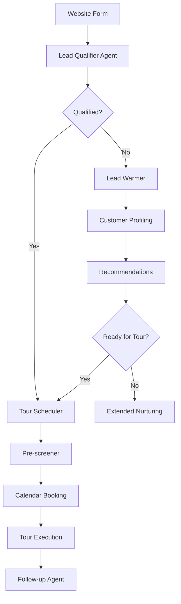

# Mejores Prácticas para Agentes IA de WhatsApp - UrbanHub

## Documento de Referencia

**Fecha**: 24 de julio, 2025  
**Proyecto**: UrbanHub AI Agents para Bird.com  
**Enfoque**: Bienes raíces premium en México  
**Plataforma**: WhatsApp Business API + Bird.com + OpenAI

---

## Resumen Ejecutivo

Este documento consolida las mejores prácticas globales para agentes IA de WhatsApp en el sector inmobiliario, específicamente adaptadas para el mercado mexicano y la implementación de UrbanHub. Basado en investigación de la industria 2025 y análisis de la documentación técnica existente.

### Hallazgos Clave

- **55% de leads inmobiliarios se pierden** por seguimiento tardío o comunicación deficiente
- **WhatsApp es el canal preferido** en México para comunicación comercial
- **24/7 disponibilidad** aumenta conversión de leads en 40-60%
- **Personalización basada en IA** mejora conversión 15-20%
- **Integración CRM automática** reduce tiempo de procesamiento 30-35%

---

## 1. Arquitectura de Agentes IA Optimizada

### 1.1 Especialización por Función

```typescript
// Arquitectura de Agentes Especializados
const UrbanHubAgents = {
  leadQualifier: {
    purpose: "Clasificación inicial y calificación básica",
    responseTime: "< 5 minutos",
    successMetric: "90% leads contactados dentro de tiempo objetivo"
  },
  
  leadWarmer: {
    purpose: "Warming de leads no responsivos con secuencia de valor",
    triggers: ["24-48 horas sin respuesta", "No scheduling after qualification"],
    conversationRate: "Target 25% reactivation"
  },
  
  tourScheduler: {
    purpose: "Gestión automática de calendario y booking",
    integration: ["HubSpot Calendar", "Leasing Agent Calendars"],
    confirmationRate: "Target 95% confirmed tours"
  },
  
  preScreener: {
    purpose: "Recolección inteligente de información por prioridad",
    dataPoints: ["Budget", "Timeline", "Space requirements", "Location preference"],
    completionRate: "Target 80% complete profiles before tour"
  },
  
  followUpAgent: {
    purpose: "Optimización post-tour y feedback",
    timing: "24 horas post-tour",
    conversionTarget: "35% tour-to-application rate"
  }
};
```

### 1.2 Flujo de Handoff Inteligente



---

## 2. Embedding Search y Características Técnicas

### 2.1 Implementación de Vector Search

**Situación Actual con Bird.com:**
- Bird.com no tiene capacidades nativas de embedding search
- Requiere implementación custom de vector database
- Integración con OpenAI para generación de embeddings

```typescript
// Arquitectura de Búsqueda Semántica
interface PropertyEmbeddingSystem {
  vectorDatabase: 'Pinecone' | 'Weaviate' | 'Qdrant';
  embeddingModel: 'text-embedding-ada-002';
  searchCapabilities: {
    semanticPropertyMatch: boolean;
    amenityRecommendations: boolean;
    neighborhoodSimilarity: boolean;
    budgetOptimization: boolean;
  };
}

class UrbanHubPropertySearch {
  async findSimilarProperties(
    userQuery: string,
    preferences: UserPreferences
  ): Promise<Property[]> {
    // 1. Generar embedding del query del usuario
    const queryEmbedding = await this.openai.createEmbedding(userQuery);
    
    // 2. Buscar propiedades similares en vector DB
    const similarProperties = await this.vectorDB.query({
      vector: queryEmbedding,
      topK: 5,
      filter: {
        budget: preferences.budget,
        location: preferences.locations,
        available: true
      }
    });
    
    // 3. Reranking basado en preferences específicas
    return this.rerank(similarProperties, preferences);
  }
}
```

### 2.2 Knowledge Base Inteligente

```typescript
// Sistema de Knowledge Base para UrbanHub
interface UrbanHubKnowledgeBase {
  properties: {
    josefa: PropertyData;
    matilde: PropertyData;
  };
  
  neighborhoods: {
    reforma: NeighborhoodInfo;
    juarez: NeighborhoodInfo;
  };
  
  amenities: AmenityDescription[];
  
  processes: {
    leasing: ProcessSteps;
    noGarantor: RequirementsList;
    payments: PaymentOptions;
  };
  
  faq: {
    question: string;
    answer: string;
    category: 'pricing' | 'amenities' | 'process' | 'location';
    embedding: number[];
  }[];
}
```

### 2.3 Retrieval-Augmented Generation (RAG)

```typescript
// RAG Implementation para respuestas contextuales
class UrbanHubRAG {
  async generateContextualResponse(
    userQuery: string,
    conversationHistory: Message[]
  ): Promise<string> {
    // 1. Extraer información relevante del knowledge base
    const relevantInfo = await this.retrieveRelevantInfo(userQuery);
    
    // 2. Construir contexto con historial de conversación
    const context = this.buildContext(relevantInfo, conversationHistory);
    
    // 3. Generar respuesta con OpenAI
    const response = await this.openai.chat.completions.create({
      model: "gpt-4",
      messages: [
        {
          role: "system",
          content: `Eres Maya, especialista de UrbanHub. Usa esta información: ${context}`
        },
        {
          role: "user", 
          content: userQuery
        }
      ],
      max_tokens: 300,
      temperature: 0.7
    });
    
    return response.choices[0].message.content;
  }
}
```

---

## 3. Optimización de Flujo Conversacional

### 3.1 Principios de Conversación Natural

**Mejores Prácticas Identificadas:**

1. **Respuesta Instantánea**: < 2 segundos para queries automáticas
2. **Personalización Progresiva**: Recopilar información gradualmente
3. **Contexto Persistente**: Mantener historial de conversación
4. **Handoff Inteligente**: Escalación suave a agentes humanos

### 3.2 Secuencia de Calificación Optimizada

```typescript
// Flujo de Calificación Mejorado
const OptimizedQualificationFlow = {
  step1: {
    trigger: "Website form submission",
    action: "Immediate greeting with building-specific message",
    timing: "< 5 minutos",
    message: "¡Hola [Nombre]! Soy Maya de UrbanHub. Vi tu interés en [Building] y me da mucho gusto contactarte. ¿Te gustaría agendar una visita?"
  },
  
  step2: {
    condition: "Si dice 'Sí' a tour",
    action: "Direct scheduling",
    followUp: "Pre-screening questions"
  },
  
  step3: {
    condition: "Si dice 'No' a tour",
    action: "Enter warming sequence",
    duration: "5 touchpoints over 14 days",
    content: ["Brand benefits", "Social proof", "Property highlights", "Incentive offer", "Final attempt"]
  }
};
```

### 3.3 Warming Sequence Basada en Valor

```typescript
// Secuencia de Warming Optimizada
const WarmingSequence = {
  day1: {
    type: "soft_followup",
    content: "Value proposition reminder",
    cta: "Promotional offer mention"
  },
  
  day3: {
    type: "visual_content",
    content: "Property videos/photos",
    cta: "Amenity highlights"
  },
  
  day7: {
    type: "social_proof",
    content: "New resident testimonials",
    cta: "Experience invitation"
  },
  
  day14: {
    type: "final_incentive",
    content: "VIP tour offer + financing options",
    cta: "Last chance with opt-out respect"
  }
};
```

---

## 4. Adaptación Cultural para México

### 4.1 Comunicación Culturalmente Apropiada

**Elementos Clave:**

```typescript
// Configuración Cultural Mexicana
const MexicanCulturalSettings = {
  language: {
    primary: "Spanish (Mexican)",
    formality: "Start with 'usted', adapt to customer tone",
    expressions: [
      "¡Qué tal!",
      "¡Perfecto!",
      "Me da mucho gusto",
      "¡Excelente!",
      "Por supuesto"
    ]
  },
  
  communication: {
    whatsappEtiquette: true,
    businessHours: "9 AM - 8 PM CST",
    familyDecisionRespect: true,
    responseExpectation: "< 30 minutes during business hours"
  },
  
  businessContext: {
    noGarantorProcess: "Emphasize 'Sin aval, sin complicaciones'",
    paymentMethods: ["SPEI", "OXXO", "Tarjeta de crédito/débito"],
    transportation: ["Metro", "Metrobús", "Uber/Didi"],
    neighborhoods: "Use local CDMX geography knowledge"
  }
};
```

### 4.2 Horarios y Timing Culturalmente Apropiados

```typescript
// Timing Optimization para México
const MexicanTimingStrategy = {
  businessHours: {
    weekdays: "9:00 AM - 8:00 PM CST",
    saturday: "10:00 AM - 6:00 PM CST", 
    sunday: "11:00 AM - 5:00 PM CST"
  },
  
  responsePatterns: {
    immediate: "< 5 minutes (business hours)",
    delayed: "< 2 hours (after hours)",
    followUp: "24-48 hours for cold leads"
  },
  
  greeting: {
    morning: "¡Buenos días!",
    afternoon: "¡Buenas tardes!",
    evening: "¡Buenas noches!",
    adaptation: "Based on Mexico City timezone"
  }
};
```

---

## 5. Integraciones Técnicas Avanzadas

### 5.1 HubSpot Integration Bidireccional

```typescript
// Integración HubSpot Optimizada
class HubSpotIntegration {
  async syncLeadFromBird(birdContact: BirdContact): Promise<HubSpotContact> {
    const hubspotData = {
      properties: {
        email: birdContact.email,
        phone: birdContact.phone,
        firstname: birdContact.firstName,
        lastname: birdContact.lastName,
        property_interest: birdContact.customFields.propertyInterest,
        budget_range: birdContact.customFields.budget,
        lead_source: 'WhatsApp - Bird.com',
        lead_status: 'Contacted',
        last_contacted: new Date().toISOString()
      }
    };
    
    return await this.hubspotClient.crm.contacts.basicApi.create(hubspotData);
  }
  
  async updateConversationActivity(
    contactId: string, 
    conversation: Conversation
  ): Promise<void> {
    const activity = {
      engagement: {
        type: 'NOTE',
        timestamp: Date.now()
      },
      associations: {
        contactIds: [contactId]
      },
      metadata: {
        body: `WhatsApp Conversation Summary:\n${conversation.summary}\n\nAgent: ${conversation.agent}\nDuration: ${conversation.duration}\nOutcome: ${conversation.outcome}`
      }
    };
    
    await this.hubspotClient.engagements.create(activity);
  }
}
```

### 5.2 Calendar Integration Inteligente

```typescript
// Sistema de Calendar Booking Avanzado  
class IntelligentCalendarSystem {
  async findOptimalTourSlots(
    propertyId: string,
    userPreferences: SchedulingPreferences
  ): Promise<AvailableSlot[]> {
    // 1. Obtener disponibilidad de leasing agents
    const agents = await this.getLeasingAgents(propertyId);
    const availability = await Promise.all(
      agents.map(agent => this.getAgentAvailability(agent.id))
    );
    
    // 2. Filtrar por preferencias del usuario
    const filteredSlots = availability
      .flat()
      .filter(slot => this.matchesPreferences(slot, userPreferences))
      .sort((a, b) => this.scoreSlot(b) - this.scoreSlot(a));
    
    // 3. Devolver top 5 opciones
    return filteredSlots.slice(0, 5);
  }
  
  async bookTourWithConfirmation(
    slot: AvailableSlot,
    contactInfo: ContactInfo
  ): Promise<BookingConfirmation> {
    // 1. Crear evento en calendario del agente
    const calendarEvent = await this.createCalendarEvent(slot, contactInfo);
    
    // 2. Enviar notificación al agente
    await this.notifyLeasingAgent(slot.agentId, contactInfo);
    
    // 3. Programar recordatorios automáticos
    await this.scheduleReminders(calendarEvent.id, contactInfo);
    
    // 4. Actualizar HubSpot
    await this.updateHubSpotTourScheduled(contactInfo.hubspotId);
    
    return {
      confirmationId: calendarEvent.id,
      agent: slot.agent,
      dateTime: slot.dateTime,
      property: slot.property,
      confirmationSent: true
    };
  }
}
```

---

## 6. Métricas y KPIs de Optimización

### 6.1 Métricas Clave de Rendimiento

```typescript
// KPIs para Agentes IA de WhatsApp
interface UrbanHubKPIs {
  responseMetrics: {
    averageResponseTime: number; // Target: < 2 minutes
    firstResponseRate: number; // Target: 95% within 5 minutes
    businessHoursAvailability: number; // Target: 99.5%
  };
  
  engagementMetrics: {
    conversationStartRate: number; // Target: 85% of contacted leads
    qualificationRate: number; // Target: 70% of engaged leads
    tourBookingRate: number; // Target: 25% of qualified leads
    showUpRate: number; // Target: 85% of booked tours
  };
  
  conversionMetrics: {
    leadToTourRate: number; // Target: 20% overall
    tourToApplicationRate: number; // Target: 35%
    applicationToLeaseRate: number; // Target: 75%
    overallConversionRate: number; // Target: 5.25% lead-to-lease
  };
  
  qualityMetrics: {
    customerSatisfactionScore: number; // Target: 4.5/5
    escalationRate: number; // Target: < 15%
    conversationCompletionRate: number; // Target: 90%
    accuracyScore: number; // Target: 98% information accuracy
  };
  
  operationalMetrics: {
    avgConversationDuration: number; // Target: 8-12 minutes
    messagesPerConversion: number; // Track efficiency
    costPerQualifiedLead: number; // ROI measurement
    automationRate: number; // Target: 80% fully automated
  };
}
```

### 6.2 Dashboard de Analytics

```typescript
// Dashboard Configuration
const AnalyticsDashboard = {
  realTimeMetrics: [
    'Active conversations',
    'Response time (last hour)', 
    'Leads generated today',
    'Tours scheduled today'
  ],
  
  dailyReports: [
    'Conversion funnel progression',
    'Agent performance comparison',
    'Customer satisfaction scores',
    'Revenue pipeline impact'
  ],
  
  weeklyAnalysis: [
    'Conversation flow optimization opportunities',
    'A/B testing results',
    'Seasonal trend analysis',
    'Competitive performance benchmarks'
  ],
  
  alerts: [
    'Response time > 5 minutes',
    'Escalation rate > 20%',
    'Customer satisfaction < 4.0',
    'System downtime detected'
  ]
};
```

---

## 7. Implementación y Optimización Continua

### 7.1 Proceso de A/B Testing

```typescript
// Framework de A/B Testing
class ConversationOptimization {
  async runABTest(
    testName: string,
    variants: ConversationVariant[]
  ): Promise<TestResults> {
    const testConfig = {
      name: testName,
      duration: '2 weeks',
      trafficSplit: '50/50',
      successMetric: 'tour_booking_rate',
      minimumSampleSize: 200
    };
    
    // Tests comunes para UrbanHub:
    const commonTests = [
      'Opening message variants',
      'Question order optimization', 
      'Tone formal vs casual',
      'Incentive timing',
      'Follow-up frequency'
    ];
    
    return await this.analyticsEngine.runTest(testConfig);
  }
}
```

### 7.2 Feedback Loop y Mejora Continua

```typescript
// Sistema de Mejora Continua
const ContinuousImprovement = {
  dataCollection: {
    conversationLogs: 'Analyze all interactions for patterns',
    customerFeedback: 'Post-tour satisfaction surveys',
    agentFeedback: 'Human agent insights on handoffs',
    performanceData: 'KPI tracking and trend analysis'
  },
  
  analysis: {
    weekly: 'Conversation flow performance review',
    monthly: 'Customer journey optimization',
    quarterly: 'Strategic AI capabilities upgrade',
    annually: 'Platform and technology assessment'
  },
  
  implementation: {
    quickFixes: 'Message template updates (< 1 day)',
    flowChanges: 'Conversation logic modifications (1 week)',
    featureUpdates: 'New AI capabilities (2-4 weeks)',
    platformUpgrades: 'Major system enhancements (1-3 months)'
  }
};
```

---

## 8. Checklist de Implementación

### 8.1 Setup Técnico Prioritario

- [ ] **Embedding Search Implementation**
  - Vector database setup (Pinecone/Weaviate)
  - Property data vectorization
  - RAG system integration

- [ ] **Maya Configuration Update**
  - Implement best practices from research
  - Cultural adaptation improvements
  - Response optimization

- [ ] **Calendar Integration**
  - Real-time agent availability
  - Automatic booking confirmation
  - Reminder system setup

- [ ] **Analytics Dashboard**
  - KPI tracking implementation
  - Real-time monitoring setup
  - Alert system configuration

### 8.2 Optimización de Contenido

- [ ] **Mexican Spanish Optimization**
  - Local expressions integration
  - Formal/informal tone adaptation
  - Cultural context validation

- [ ] **Property Knowledge Base**
  - Josefa & Matilde detailed info
  - Amenity descriptions
  - Neighborhood guides
  - Process explanations

- [ ] **Conversation Flow Testing**
  - All agent handoff scenarios
  - Error handling validation
  - Edge case coverage

### 8.3 Launch Preparation

- [ ] **Team Training**
  - Leasing agent AI handoff training
  - Customer service protocol updates
  - Quality assurance procedures

- [ ] **Monitoring Setup**
  - Performance alerts
  - Conversation quality checks
  - Customer satisfaction tracking

- [ ] **Feedback Systems**
  - Post-interaction surveys
  - Agent performance reviews
  - Continuous improvement processes

---

## Conclusión

La implementación de estas mejores prácticas posicionará a UrbanHub como líder en automatización inmobiliaria en México. El enfoque en embedding search, optimización cultural, y mejora continua garantizará una experiencia superior para clientes y agentes.

**Próximos Pasos:**
1. Implementar embedding search system
2. Actualizar configuración de Maya
3. Establecer analytics dashboard
4. Iniciar programa de optimización continua

**ROI Esperado:**
- 40-60% mejora en respuesta inicial a leads
- 25-30% aumento en tour bookings
- 15-20% mejora en conversión general
- 30-35% reducción en tiempo de procesamiento manual